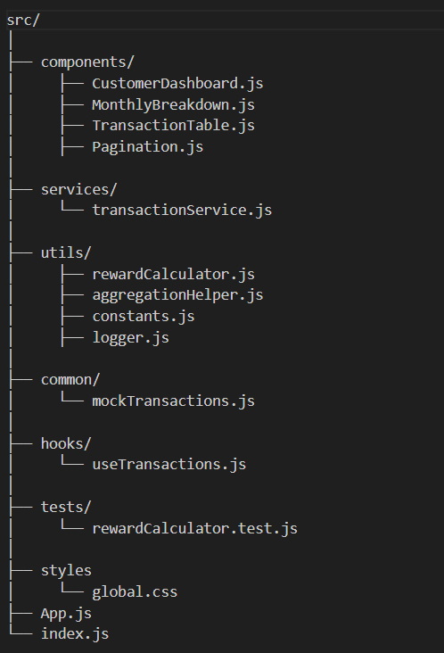
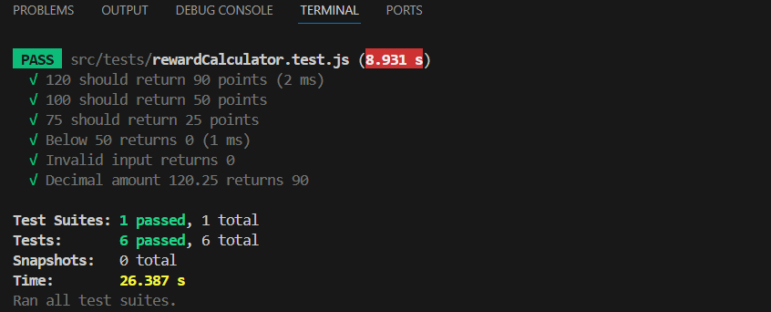
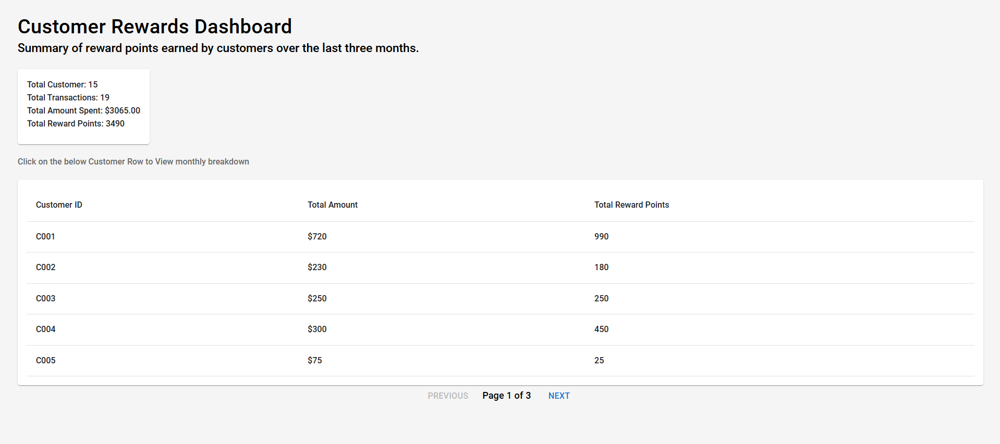
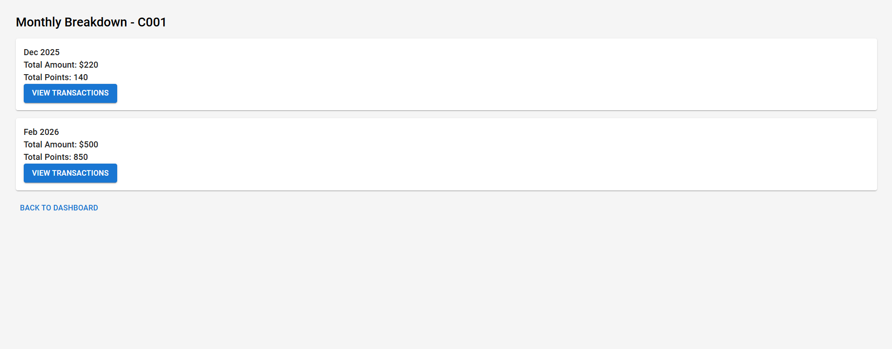
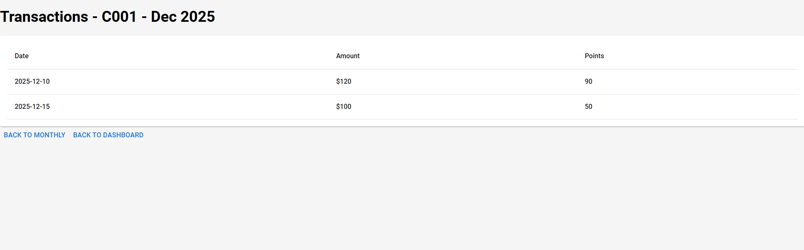

🛠 Tech Stack

- React.js (Functional Components)
- React Router DOM (Client-side routing)
- PropTypes (Component type validation)
- JavaScript (ES6+)
- CSS (MUI)
- Custom Hooks
- useMemo for performance optimization

📦 Dependencies

- npm install
- npm install react-router-dom prop-types
- npm install @mui/material @emotion/react @emotion/styled

🔹 react-router-dom

Used for:
- Page navigation
- Dynamic routes (/customer/:id)
- useNavigate hook

🔹 prop-types

Used for:
- Runtime type checking of component props
- Ensures components receive correct data types
- Improves code reliability and maintainability

---

⚙️ Installation & Setup

1️⃣ Clone Repository

git clone https://github.com/saibalajis/rewards-app.git

cd rewards-app

2️⃣ Install Dependencies

npm install

npm install react-router-dom prop-types

npm install @mui/material @emotion/react @emotion/styled

3️⃣ Run Application

npm start

Open in browser:
http://localhost:3000

# Customer Rewards Dashboard

## Project Overview
This project is a Customer Rewards Dashboard built using React.js.  
It calculates and displays reward points earned by customers over a period of transactions.  

The dashboard includes:

- KPI summary cards (Key Performance Indicators)
- Paginated customer summary table
- Monthly breakdown of reward points per customer
- Professional UI styling with hover effects and card layout
- Loading and error handling for simulated API calls

---

## Features

1. **Reward Points Calculation Logic**
   - 2 points for every dollar spent over $100 per transaction
   - 1 point for every dollar spent between $50 and $100 per transaction
   - Calculates points per transaction, per month, and total per customer

2. **Dashboard UI**
   - KPI summary cards (Total Customers, Total Transactions, Total Amount Spent, Total Reward Points)
   - Responsive Grid-based layout using MUI Grid and Card components
   -  Customer summary table built with MUI Table, including - Hover-enabled clickable rows, Paginated results, Clear header structure
   - Consistent spacing and layout using MUI’s design system
   - Error and loading state handling using MUI Typography

3. **Pagination**
   - Displays customers in pages for better scalability

4. **Mock API**
   - Simulated asynchronous API call to fetch transactions
   - Handles loading and error states

5. **Reusable Components**
   - Table, Pagination, KPI Cards, etc.
   - Proper folder structure: `components`, `hooks`, `utils`, `services`, `common`, `styles`

6. **Responsive Styling**
   - Professional global CSS and MUI
   - Hover effects with pointer and spacing for better UX
   - Corporate-style colors and typography

---

## Folder Structure

src/
│
├── components/
│     ├── CustomerDashboard.js
│     ├── MonthlyBreakdown.js
│     ├── TransactionTable.js
│     ├── Pagination.js
│
├── services/
│     └── transactionService.js
│
├── utils/
│     ├── rewardCalculator.js
│     ├── aggregationHelper.js
│     ├── constants.js
│     ├── logger.js
│
├── common/
│     └── mockTransactions.js
│
├── hooks/
│     └── useTransactions.js
│
├── tests/
│     └── rewardCalculator.test.js
│
├── styles
│     └── global.css
├── App.js
└── index.js

Test Case:

Dashboard (homepage):

 

Monthly breakdown page (Click any customer row in homepage):

Customers transactions details page:
